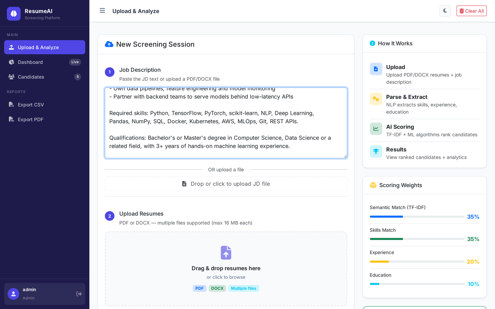
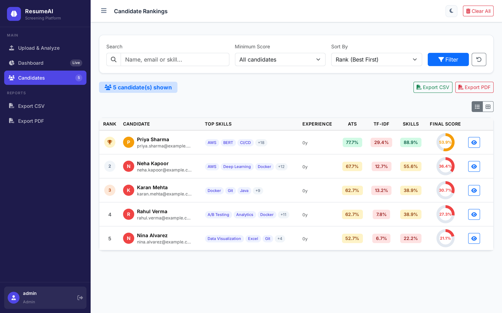
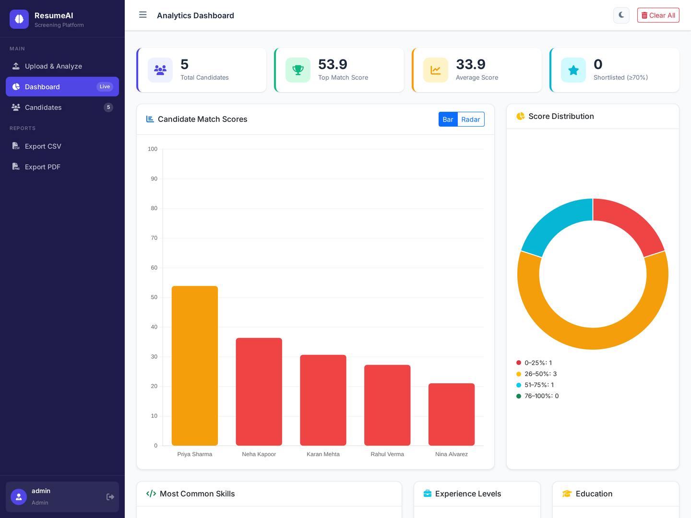
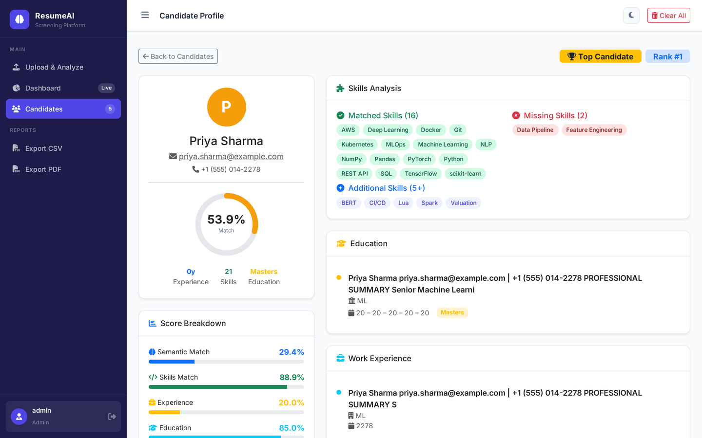

<div align="center">

# 🤖 AI Resume Screener

### Screen hundreds of resumes in seconds. Rank candidates by job fit. Generate interview questions automatically.

[](https://python.org)
[](https://flask.palletsprojects.com)
[](https://spacy.io)
[](https://scikit-learn.org)
[](LICENSE)

[](https://render.com/deploy?repo=https://github.com/aasimansari1/ai-resume-screener)

</div>

---

> **Tired of manually reading 200 resumes for a single job posting?**
> Upload them all, paste the job description, and get a ranked leaderboard of candidates with scores, skill gaps, ATS ratings, and AI-generated interview questions — in under 30 seconds.

---

## ✨ Features

<table>
<tr>
<td width="50%">

**📄 Smart Parsing**
- PDF & DOCX support, batch upload
- Extracts name, email, phone, LinkedIn, GitHub
- Detects skills from a **336-skill database**
- Parses education, experience & certifications

</td>
<td width="50%">

**🧠 AI Scoring Engine**
- TF-IDF + Cosine Similarity semantic match
- Skills gap analysis (matched vs missing)
- Experience & education level scoring
- ATS compatibility check

</td>
</tr>
<tr>
<td width="50%">

**📊 Analytics Dashboard**
- Ranked candidate leaderboard
- Bar, radar, doughnut & pie charts (Chart.js)
- Table view + card view toggle
- Filter by score, search by name/skill

</td>
<td width="50%">

**🎯 Recruiter Tools**
- Auto-generated behavioral & technical interview Qs
- Actionable resume improvement suggestions
- Export ranked reports as **CSV or color-coded PDF**
- Dark mode support

</td>
</tr>
</table>

---

## 📸 Screenshots

| Upload & Analyze | Candidate Rankings |
|:---:|:---:|
|  |  |

| Analytics Dashboard | Candidate Detail |
|:---:|:---:|
|  |  |

---

## 🏗️ How It Works

```
  📄 Resumes (PDF/DOCX)          📋 Job Description
          │                               │
          ▼                               ▼
  ┌───────────────┐              ┌────────────────┐
  │ resume_parser │              │   TF-IDF       │
  │  (spaCy NLP)  │              │  Vectorizer    │
  └───────┬───────┘              └───────┬────────┘
          │  name, skills, exp           │
          └──────────────┬───────────────┘
                         ▼
          ┌──────────────────────────────┐
          │        Scoring Engine        │
          │  Semantic  35%               │
          │  Skills    35%               │
          │  Experience 20%              │
          │  Education  10%              │
          └──────────────┬───────────────┘
                         ▼
             📊 Ranked Leaderboard
             🎤 Interview Questions
             💡 Improvement Tips
             📁 CSV / PDF Export
```

---

## ⚡ Quick Start

```bash
git clone https://github.com/aasimansari1/ai-resume-screener.git
cd ai-resume-screener

python3 -m venv venv
source venv/bin/activate        # Windows: venv\Scripts\activate

pip install -r requirements.txt
python -m spacy download en_core_web_sm

cp .env.example .env            # edit credentials if needed
python app.py
```

Open **http://localhost:5000** — default login: `admin` / `admin123`

---

## 🔧 Configuration

```env
# .env
SECRET_KEY=your-secret-key
ADMIN_USERNAME=admin
ADMIN_PASSWORD=your-secure-password

# Optional — email notifications
MAIL_SERVER=smtp.gmail.com
MAIL_USERNAME=your@gmail.com
MAIL_PASSWORD=your-app-password
```

---

## 📐 Scoring Algorithm

| Component | Weight | Method |
|---|:---:|---|
| Semantic Match | **35%** | TF-IDF cosine similarity between resume and JD |
| Skills Match | **35%** | Jaccard overlap: extracted skills vs required skills |
| Experience | **20%** | Years of experience vs job requirement |
| Education | **10%** | Degree level (PhD > Masters > Bachelor > Other) |

ATS score is calculated separately and covers keyword density, section completeness, and contact info quality.

---

## 🗂️ Project Structure

```
ai-resume-screener/
├── app.py                  # Flask routes, auth, CSV/PDF export
├── resume_parser.py        # spaCy NLP engine — 694 lines, 336-skill DB
├── rank_candidates.py      # Scoring, ranking, interview Q generator
├── config.py               # App configuration
├── requirements.txt
├── .env.example
├── templates/
│   ├── base.html           # Sidebar layout, dark mode
│   ├── index.html          # Drag & drop upload
│   ├── dashboard.html      # KPI cards + 5 Chart.js charts
│   ├── candidates.html     # Ranked table + card view
│   ├── candidate_detail.html  # Full profile, radar chart, interview Qs
│   └── login.html
└── static/
    ├── css/style.css
    └── js/main.js
```

---

## 🚀 Deploy to Render (Free)

Click the **Deploy to Render** button at the top, or manually:

1. Fork this repo
2. Go to [render.com](https://render.com) → **New Web Service**
3. Connect your fork
4. Set env vars: `SECRET_KEY`, `ADMIN_USERNAME`, `ADMIN_PASSWORD`
5. Build: `pip install -r requirements.txt && python -m spacy download en_core_web_sm`
6. Start: `gunicorn app:app`

---

## 🛠️ Tech Stack

| Layer | Technology |
|---|---|
| Web Framework | Flask 3.0, Flask-Login |
| NLP | spaCy 3.7 (`en_core_web_sm`), NLTK |
| ML | scikit-learn (TF-IDF, Cosine Similarity) |
| PDF Parsing | pdfplumber, PyPDF2 |
| DOCX Parsing | docx2txt, python-docx |
| Data | pandas, numpy |
| PDF Reports | ReportLab |
| Frontend | Bootstrap 5, Chart.js, Font Awesome |
| Deployment | Render, Gunicorn |

---

## 🤝 Contributing

Contributions are welcome! Here are some ideas:

- 🌐 Multi-language resume support
- 🔗 LinkedIn profile scraping integration
- 🤖 GPT-powered summary generation
- 📡 REST API endpoints for programmatic access
- 📧 Email notifications when screening is complete

```bash
# Get started
git checkout -b feature/your-feature
git commit -m 'Add your feature'
git push origin feature/your-feature
# Open a Pull Request
```

---

## 📄 License

MIT © [Mohd Aasim Ansari](https://github.com/aasimansari1)

---

<div align="center">

**Found this useful? Please ⭐ star the repo — it helps other recruiters and developers find it!**

</div>
